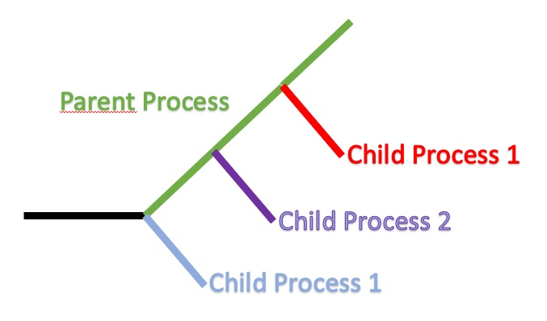
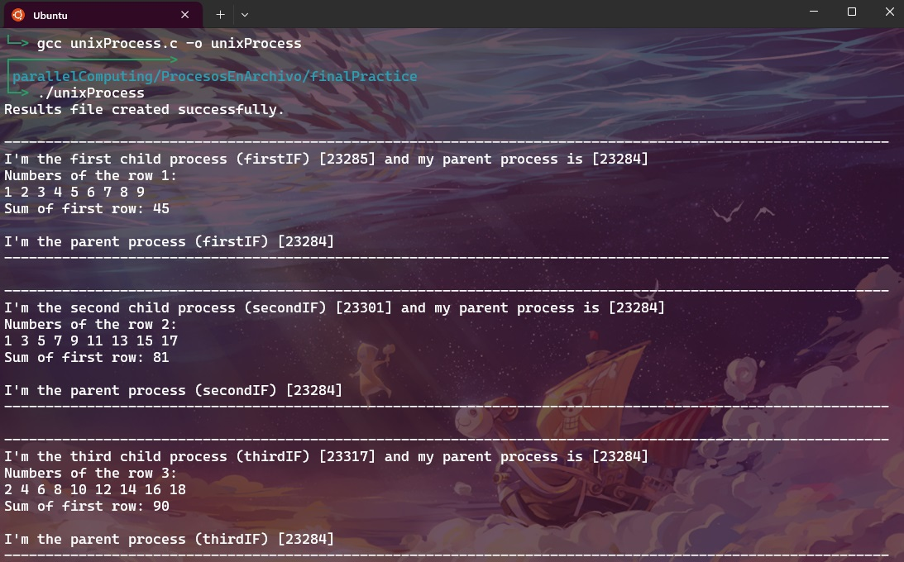

# Unix Process Program

## Description

This program is designed to calculate the sum of rows of a matrix contained in the "matrix.txt" file and save the results in a new file. The main process is called the "parent process" and creates multiple "child processes" to process each row of the matrix concurrently.

## Input Matrix

The "matrix.txt" file contains the following matrix:
| 1 | 2 | 3 | 4 | 5 | 6 | 7 | 8 | 9 |
|---|---|---|---|---|---|---|---|---|
| 1 | 3 | 5 | 7 | 9 | 11 | 13 | 15 | 17 |
| 2 | 4 | 6 | 8 | 10 | 12 | 14 | 16 | 18 |

## How does it work?

1. The parent process creates an empty file where the results of the row summation will be stored.

2. Next, the parent process initiates a child process for each row of the matrix. In this case, three child processes are created to process each of the three rows of the matrix.

3. Each child process opens the "matrix.txt" file to extract the correspond information. Each child process handles a different row of the matrix.

4. Each child process sums the elements of its respective row and calculates the result.

5. The results of the row summations performed by the child processes are saved in the results file created by the parent process.

## Results

• The results of the row summations are stored in a results file. Each line of this file contains the sum of a row of the matrix.

• This program efficiently processes the matrix using processes to accelerate the row summation calculation.

